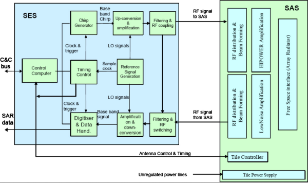
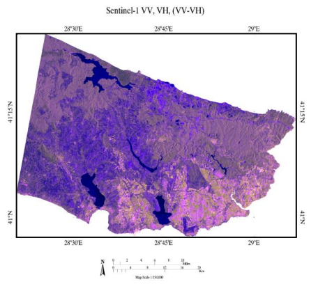

## Technical Overview

- **SAR Imaging Principle:** Active microwave sensor transmitting signals and analyzing return waves
- **Sentinel-1A & 1B:** Launched in **2014 & 2016**
- **Spatial Resolution:** ~5m x 20m (Interferometric Wide Swath Mode)
- **Revisit Time:** 6–12 days (global coverage)

  

      Figure 2 SAR Instrument Components

      Source: copernicus website
    

---

## Limitation

**Persistent challenges include**:

- Speckle noise requiring multi-temporal averaging (minimum 3-5 acquisitions)

- Geometric distortions in mountainous terrain (incidence angle >45°)

- Polarization dependency where cross-pol (VH) data shows 30-40% lower SNR than co-pol (VV)

- Temporal decorrelation rendering InSAR unusable after >7 days in vegetated areas

**Ongoing developments** like the proposed Sentinel-1 Next Generation (2028 launch) aim to address these through:

- Higher resolution (1m Spotlight mode)

- Tri-polarization capability

- 12-hour revisit time with constellation enhancement

---

## Application 1: Flood Monitoring 

The innovative urban flood detection methodology developed by Chini(2019) demonstrates the unique capabilities of Sentinel-1 SAR data for disaster monitoring. Focusing on Hurricane Harvey's impact on Houston in 2017, their research successfully identified floodwater in urban areas by analyzing interferometric coherence loss combined with VV backscatter thresholds. Using 20m resolution Interferometric Wide mode data, the method achieved 89% detection accuracy in dense urban environments, significantly outperforming conventional single-feature approaches. This breakthrough is particularly valuable for emergency response operations, as it overcomes the limitations of optical sensors during cloud-covered disaster events. The study's validation incorporated multiple data sources including high-resolution optical imagery and ground truth measurements, confirming the robustness of SAR-based flood mapping in complex urban landscapes.
---

## Application 1: Flood Monitoring 

  

      Figure 3 Sentinel 1 Image of Houston flood area

      Source: Chini, 2019
    

---

## Application 2: Land cover
Abdikan(2016) conducted a comprehensive evaluation of Sentinel-1's potential for urban land cover mapping in Istanbul. Their work utilized dual-polarization (VV+VH) data processed through rigorous radiometric calibration and terrain correction, achieving an impressive 93.28% overall classification accuracy with Support Vector Machines. The study revealed distinct classification performance across four major land cover types: built-up areas (94.2% user accuracy), vegetation (91.8%), water bodies (97.1%), and bare soil (89.5%). 
A key finding was the complementary nature of VV and VH polarizations in urban feature discrimination, where VV showed better performance for built-up areas while VH improved vegetation detection. This research provides critical insights for continuous urban monitoring in persistently cloudy regions where optical data availability is limited.
---

## Application 2: Land cover

  

      Figure 4 Composite image of Sentinel VV, VH, (VV-VH)

      Source: Abdikan, 2016
    

---
## Reflection
- **Tool Proficiency**

Through this lecture, I have learned how to use Quarto and Xaringan, which are entirely new tools for me in terms of taking notes and creating presentations. These tools offer a different approach compared to traditional methods like PowerPoint or Word, allowing for greater flexibility and integration with programming languages such as R. Although I am not yet fully proficient, I find them extremely useful for organizing information and presenting data in a more dynamic and interactive way. With continuous practice, I am confident that I will become more skilled and efficient in using these tools effectively.
- **Sentinel-1**

Exploring Sentinel-1's capabilities gave me new appreciation for microwave remote sensing. Its cloud-piercing radar eyes revealed floodwaters hidden beneath storm clouds and detected subtle ground movements invisible to optical sensors. I learned to "read" the language of backscatter - how urban areas shout with bright VV returns while calm waters whisper in dark tones. The interferometric coherence maps were particularly fascinating, showing where floods had scrambled the radar's memory of the landscape. Though speckle noise sometimes obscured details, careful processing unveiled critical patterns.
---

## References

- Abdikan, S., Sanli, F. B., Ustuner, M., and Calò, F.,2016. LAND COVER MAPPING USING SENTINEL-1 SAR DATA, Int. Arch. Photogramm. Remote Sens. Spatial Inf. Sci., XLI-B7, 757–761, https://doi.org/10.5194/isprs-archives-XLI-B7-757-2016.
- https://sentiwiki.copernicus.eu/web/s1-mission
- Chini, M., Pelich, R., Pulvirenti, L., Pierdicca, N., Hostache, R., & Matgen, P. (2019). Sentinel-1 InSAR Coherence to Detect Floodwater in Urban Areas: Houston and Hurricane Harvey as A Test Case. Remote Sensing, 11(2), 107. https://doi.org/10.3390/rs11020107

